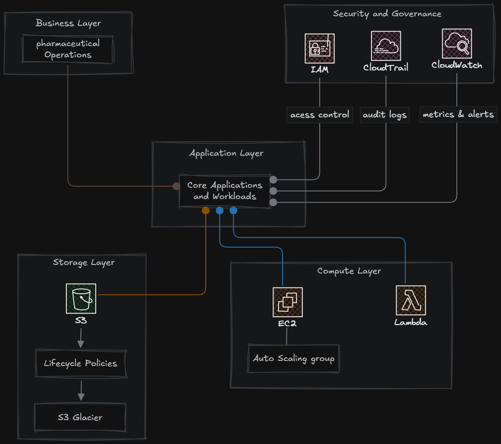

# Relatório de Implementação de Serviços AWS  
### Otimização de Custos em Operação Farmacêutica

**Data de início do projeto**: Fevereiro de 2026  
**Empresa**: Biopharma Industries  
**Responsável**: Ezequiel Miguel Cavalcante do Nascimento  

<h2></h2>

### 1. Introdução

Este relatório apresenta uma proposta de adoção estratégica de serviços
da Amazon Web Services (AWS) aplicada a um cenário de operação farmacêutica.

O objetivo principal é identificar soluções tecnológicas capazes de promover
redução imediata de custos operacionais, aumento de eficiência e melhoria
na escalabilidade dos sistemas corporativos.

**A abordagem considera os seguintes pilares**:

- Eficiência financeira  
- Elasticidade de recursos  
- Continuidade operacional  
- Segurança da informação  

<h2></h2>

### 2. Descrição do Projeto

A estratégia foi estruturada em três etapas, cada uma direcionada a uma
fonte relevante de custo dentro da operação.

 

### Arquitetura Proposta

A figura abaixo apresenta a visão geral da arquitetura recomendada,
destacando as camadas de computação, armazenamento e os controles
de segurança e governança.

  

  

*Figura 1 – Visão geral da arquitetura proposta com Amazon EC2 (Auto Scaling),
Amazon S3 (Lifecycle Policies) e AWS Lambda, integrados a uma camada transversal
de governança e monitoramento.*

<h2></h2>

### 2.1 Etapa 1 – Amazon EC2 com Auto Scaling

**Ferramenta**: Amazon EC2 + Auto Scaling  
**Foco**: Redução de custos computacionais  

**Caso de uso**:

A operação farmacêutica apresenta variações significativas de demanda,
principalmente em períodos promocionais, sazonalidades comerciais e
picos de acesso aos sistemas de gestão.

A utilização de políticas de Auto Scaling permite o ajuste automático
da capacidade computacional conforme a carga real de trabalho,
evitando desperdícios associados a recursos ociosos.

**Principal ganho para o negócio**:

- Redução de custos com capacidade subutilizada  
- Pagamento proporcional ao uso efetivo  
- Melhoria da disponibilidade em picos operacionais  

<h2></h2>

### 2.2 Etapa 2 – Amazon S3 com Lifecycle Policies

**Ferramenta**: Amazon S3  
**Foco**: Otimização de custos de armazenamento  

**Caso de uso**:

Empresas farmacêuticas mantêm grandes volumes de dados,
incluindo documentação regulatória, relatórios históricos,
backups e registros operacionais.

A implementação de Lifecycle Policies permite a movimentação
automática de dados para camadas de armazenamento mais econômicas,
como S3 Glacier, de acordo com a frequência de acesso.

**Principal ganho para o negócio**:

- Redução significativa dos custos de armazenamento  
- Retenção segura de documentos regulatórios  
- Alta durabilidade e integridade dos dados  

<h2></h2>

### 2.3 Etapa 3 – AWS Lambda

**Ferramenta**: AWS Lambda  
**Foco**: Eliminação de custos com servidores dedicados  

**Caso de uso**:

Processos intermitentes, como geração de relatórios,
validação de arquivos e integrações entre sistemas,
não justificam a manutenção de servidores permanentemente ativos.

O modelo serverless permite execução sob demanda,
com cobrança restrita ao tempo de processamento.

**Principal ganho para o negócio**:

- Redução de custos operacionais  
- Escalabilidade automática  
- Simplificação da infraestrutura  

<h2></h2>

### 3. Segurança e Governança

A proposta considera práticas essenciais de segurança,
fundamentais em ambientes farmacêuticos.

### 3.1 Gerenciamento de Identidades e Acessos

**Serviço**: AWS Identity and Access Management (IAM)

- Aplicação do princípio de menor privilégio  
- Criação de roles específicas por função  
- Restrição de permissões administrativas  

### 3.2 Auditoria e Monitoramento

**Serviços**: AWS CloudTrail e Amazon CloudWatch

- Rastreabilidade de ações realizadas no ambiente  
- Monitoramento contínuo de métricas operacionais  
- Alertas para eventos anômalos  

### 3.3 Proteção de Dados

- Controle de acesso a buckets S3  
- Bloqueio de acessos públicos não autorizados  
- Segregação de ambientes  

**Impacto para o negócio**:

- Redução de riscos operacionais  
- Suporte a auditorias e conformidade  
- Proteção contra uso indevido de recursos  

<h2></h2>

### 4. Análise de Impacto Financeiro (Visão Qualitativa)

**Área**: Computação  
**Situação anterior**: Capacidade fixa  
**Após AWS**: Elasticidade sob demanda  

**Área**: Armazenamento  
**Situação anterior**: Alto custo recorrente  
**Após AWS**: Tiering inteligente  

**Área**: Processos Automatizados  
**Situação anterior**: Servidores dedicados  
**Após AWS**: Execução sob demanda  

<h2></h2>

### 5. Conclusão

A adoção dos serviços AWS propostos permite à Abstergo Industries
reduzir custos operacionais, otimizar a utilização de recursos
e fortalecer a segurança da infraestrutura tecnológica.

A estratégia equilibra eficiência financeira, robustez operacional
e aderência às boas práticas de governança e segurança da informação.

Recomenda-se a continuidade da evolução da arquitetura cloud,
com monitoramento constante de custos, desempenho e riscos.

<h2></h2>

### 6. Anexos

- Documentação dos serviços AWS  
- Diagramas de arquitetura  
- Relatórios de custos comparativos  

<h2></h2>

**Assinatura do Responsável pelo Projeto**:
Ezequiel Miguel Cavalcante do Nascimento
